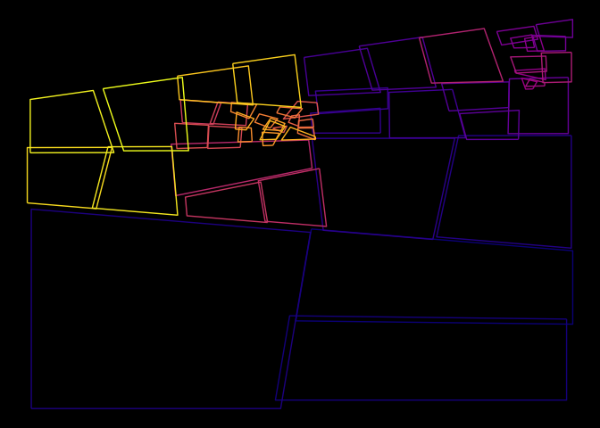

<!-- README.md is generated from README.Rmd. Please edit that file -->
Polygon splitting genViz
------------------------

### Packages

``` r
library(tidyverse)
library(ehlib)
library(sp)
library(rgeos)
library(mgcv)
library(glue)
library(viridis)
```

### Loading custom functions

``` r
sapply(paste0("R/", list.files("R/")), source, .GlobalEnv)
```

How this works
--------------

Start with a polygon. Generate a large number of points inside that polygon. Use kmeans based on said points to cut polygon into 2 polygons. Pick new polygon (random or deterministic), repeat as nesesary.

Parameters to adjust
--------------------

-   Distribution of underlaying points.
    -   Uniform. (uniform) \[✓\]
    -   Sine waves. (sinx, siny, sinxy) \[✓\]
    -   Normal. (normal) \[✓\]
-   Starting Polygon.
    -   Square. \[✓\]
    -   n-gon. \[work in progress\]
-   Number of steps.
    -   Predetermined. \[✓\]
    -   Terminating. \[\]
-   Wiggleing of polygon.
    -   Polygons are wiggled individually. \[✓\]
    -   Polygon corners are wiggled seperately. \[\]
    -   Polygons are wiggled depending on size. \[\]
    -   Types of wiggles.
        -   Normal. \[✓\]
        -   Uniform. \[\]
        -   Custom. \[\]
-   Rotate polygons.
    -   Polygons are rotated indivudually.
        -   Randomly. \[\]
        -   deterministicly. \[\]
-   Background color. \[✓\]
-   Polygon color.
    -   randomly. \[\]
    -   deterministicly. \[\]
    -   Choice of palette. \[\]

vizualize
---------

``` r
starting_polygon <- data.frame(x = c(0, 0.8, 0.8, 0, 0),
                               y = c(0, 0, 1, 0.8, 0),
                               id = "1",
                               stringsAsFactors = FALSE)

data <- data_gen_polygon(starting_polygon, 50000, type = "uniform")

p <- gen_art(starts_data = data, start_poly = starting_polygon, steps = 50) %>%
  wiggle(sd = 1 / 100) %>%
  ggplot(aes(x, y, group = id, color = factor(id))) +
  geom_path() +
  theme_void() +
  guides(color = "none") +
  theme(plot.background = element_rect(fill = 'black', colour = 'black')) +
  scale_color_viridis(discrete = TRUE, option = "plasma")
p
```



To save a particular result run the following code.

``` r
start <- Sys.time() %>% str_extract(".{10}")

nr <- sum(list.files() %>% str_detect(start)) + 1

file_name <- glue("res/{start}-squares-{nr}.png")

ggsave(filename = file_name, plot = p, dpi = 900, type = "cairo")
```
